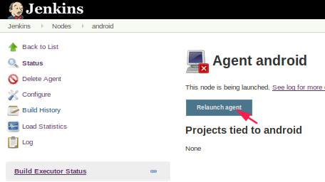

[TOC]


## 1.登录jenkins master端


进入 "Manage Jenkins" -> "Manage Nodes"


进入"new Node"


填写节点信息


添加这个节点主机的用户访问凭证


回来选择上我们刚才添加的这个用户凭证


查看启动过程


提示

```
WARNING: No entry currently exists in the Known Hosts file for this host. Connections will be denied until this new host and its associated key is added to the Known Hosts file.
```


重启




点 "See log for more",查看日志


这次就是成功了


