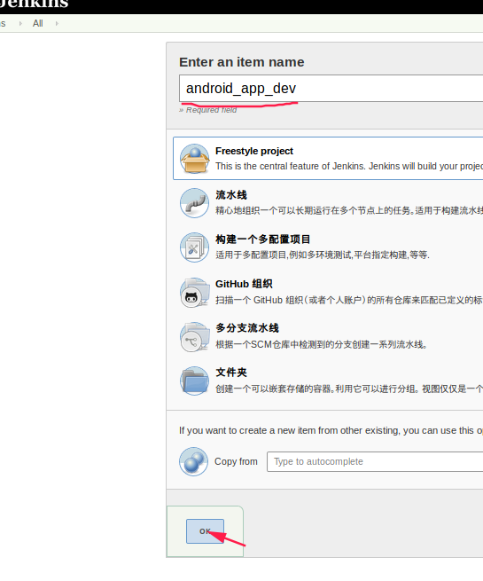
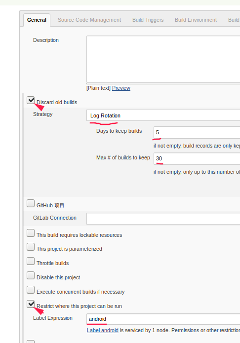
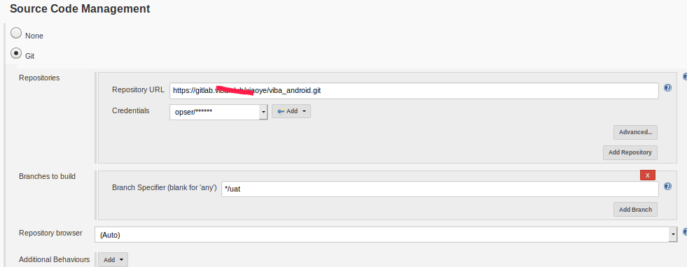

[TOC]


## 



--





构建脚本为

```shell
#!/bin/bash


workpase="/data/jenkins/workspace/"
android_app_conf="android_app_conf"

cd ${workpase}${android_app_conf}/
git pull
cd -
x="uat"
# 把会替换的文件和目录先cp到 conf/Template 目录下
rm -rf ${workpase}${android_app_conf}/Template/app
rm -rf ${workpase}${android_app_conf}/Template/build.gradle
cp -r app ${workpase}${android_app_conf}/Template/.
cp build.gradle ${workpase}${android_app_conf}/Template/.

source ${workpase}${android_app_conf}/${x}/config.conf begin
echo ${sitename}

mv app/src/main/java/com/phoenix/phoenix app/src/main/java/com/phoenix/${appname}

# 站点名称
sed -i "s/海尔智能/${sitename}/g" app/src/main/res/values/strings.xml

# 域名
sed -i "s/hltt.com/${domains[0]}/g" app/src/main/java/com/phoenix/${appname}/service/Urls.java


# APP id(在设备中的包名)
sed -i "s/com.phoenix.phoenix/com.phoenix.${appname}/g" `grep com.phoenix.phoenix -rl app`
sed -i "s/com.phoenix.phoenix/com.phoenix.${appname}/g" build.gradle

# 开发者名字 (android:authorities="com.phoenix.phoenix.fileprovider") 有两个地方要换
sed -i "s#com.phoenix.phoenix.fileprovider#${authorities}#g" app/src/main/java/com/phoenix/${appname}/ui/MainActivity.java


# icons
sed -i "s#@mipmap/phoenix_icon#@mipmap/${appname}#g" app/src/main/AndroidManifest.xml
sed -i "s#@mipmap/phoenix_icon#@mipmap/${appname}#g" app/src/main/res/layout/about_version_dialog.xml
dpis=("hdpi" "mdpi" "xhdpi" "xxhdpi" "xxxhdpi")
for dpi in ${dpis[@]}
do
  rm -f app/src/main/res/mipmap-${dpi}/ic_launcher.png
  cp  ${workpase}${android_app_conf}/${x}/icons/mipmap-${dpi}/ic_launcher.png app/src/main/res/mipmap-${dpi}/${appname}.png
 # 启动图 (一般用 750x1334的)
  cp ${workpase}${android_app_conf}/${x}/welcome/welcome.jpg app/src/main/res/mipmap-${dpi}/welcome.jpg

done

# 启动图 (一般用 750x1334的)
sed -i "s#@mipmap/startpagenew#@mipmap/welcome#g" app/src/main/res/layout/activity_main.xml

# 替换jks证书路径
sed -i "s#keyAlias 'PhoenixGame'#keyAlias '${keyAlias}'#g" app/build.gradle
sed -i "s#/root/phoenix.jks#${workpase}${android_app_conf}/${x}/${jksName}#g" app/build.gradle
sed -i "s#//signingConfig signingConfigs.release#signingConfig signingConfigs.release#g" app/build.gradle
echo ${workpase}${android_app_conf}/${x}/${appname}.jks


#开始构建
rm -f app/build/outputs/apk/release/*.apk
gradle assembleRelease
ls -l app/build/outputs/apk/release/*.apk

echo "========================================== OK ! ================================="
cp app/build/outputs/apk/release/*.apk /data/apk/app-${x}.apk
echo "cp app/build/outputs/apk/release/*.apk /root/."
ls -lh /data/apk/*apk
rm -rf app
rm -rf build.gradle
# 把conf/Template 目录下会替换的文件和目录先cp到原工程目录下
mv  ${workpase}${android_app_conf}/Template/app app
mv ${workpase}${android_app_conf}/Template/build.gradle build.gradle
```


\--


