[TOC]


参考:

https://www.jianshu.com/p/3668979476ad

https://www.sohu.com/a/108966156_465981


## 配置Keychains and Provisioning Profiles Management

接下来配置Keychains and Provisioning Profiles Management，根据顺序选择首页>系统管理>Keychains and Provisioning Profiles Management如图


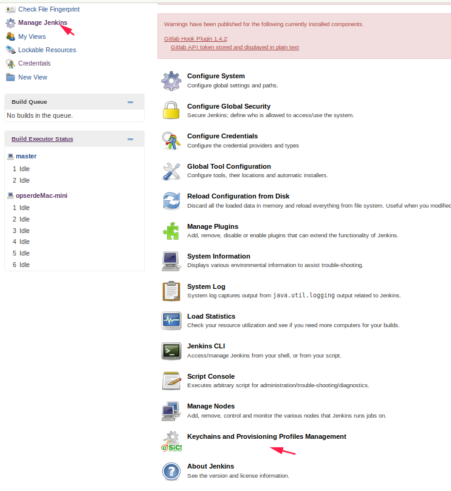

\--


由于macOS10.12以及以后的系统里面没有login.keychain文件，只有login.keychain-db,可以复制出来删除-db，也可以创建一个快捷方式名字叫做login.keychain

需要上传login.keychain文件，该文件获取方法，在终端中输入

```
opserdeMac-mini:~ jenkins$ cd ~/Library/Keychains/
opserdeMac-mini:Keychains jenkins$ ls
3C380BEA-5696-5293-9D3C-461AF3564F4D	login.keychain-db
opserdeMac-mini:Keychains jenkins$ 

```


然后添加Provisioning Profiles，上传方法和上传login.keychain一样，去选择Provisioning Profiles文件，然后upload

```
opserdeMac-mini:~ jenkins$ ls -l /Users/Shared/Jenkins/Library/MobileDevice/Provisioning\ Profiles/
```

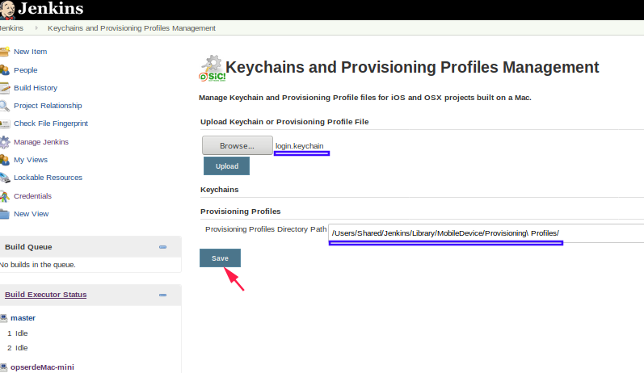


\--

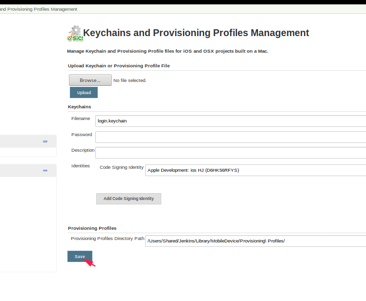

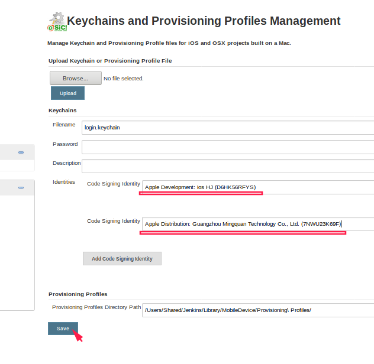

\--

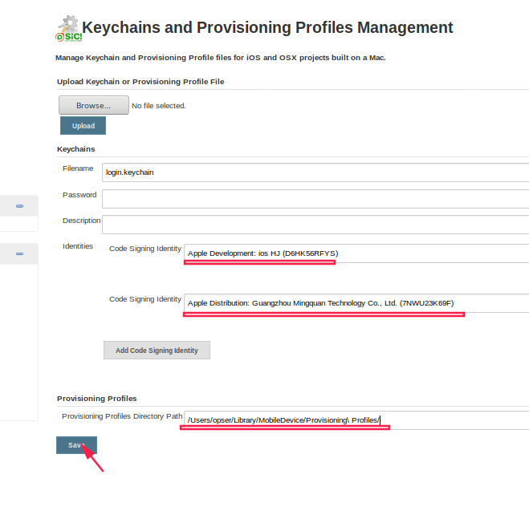

\---


## 开始配置任务

然后创建一个任务，自由风格的任务，因为构建方法会有两种,除了共同的地方，构建会分为两部分解答，第一部分是macOS10.12以前的构建方法，但是由于Jenkins的Xcode和Mac的系统版本问题，所以建议使用第二种方法。

General

创建一个自由风格的任务，然后在选择丢弃旧的构建，至于天数和保持的最大个数，按照自己的需求来就好，如图


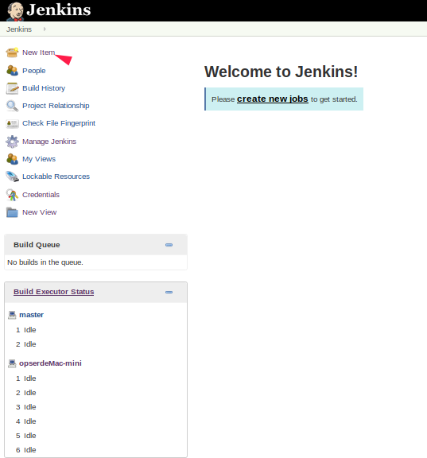

\--

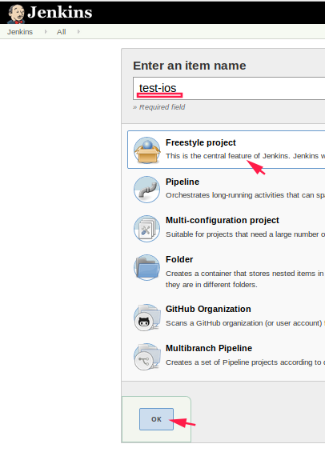

\--


在选择丢弃旧的构建，至于天数和保持的最大个数，按照自己的需求来就好

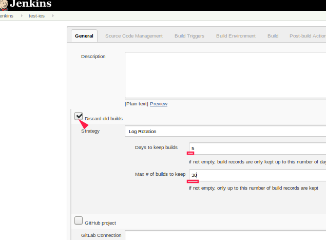

\--

源码管理

接下来是源码管理，在**Repository URL**里面添加你的git地址，我这里添加的是*http*的，如果你的项目是使用的ssh的，那么就将git开头的地址填写上，
然后**Add**添加你的git帐号，如果你的事ssh的，将ssh的密匙填写上，具体的自己百度一下就好咯，我就不多写了，结果如图

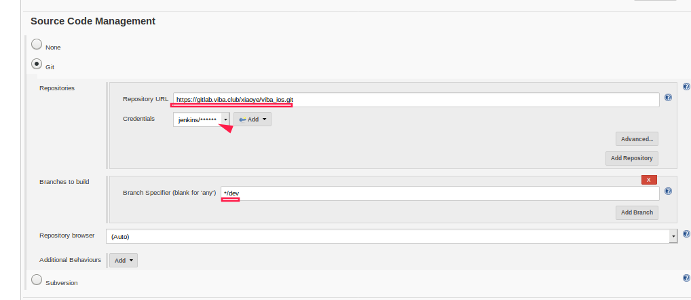


\--

构建环境

在构建环境里面勾选Keychains and Code Signing Identities和Mobile Provisioning Profiles，Keychains and Code Signing Identities是打包需要的证书，
Mobile Provisioning Profiles是打包需要的配置文件，都是可以自己选择的，


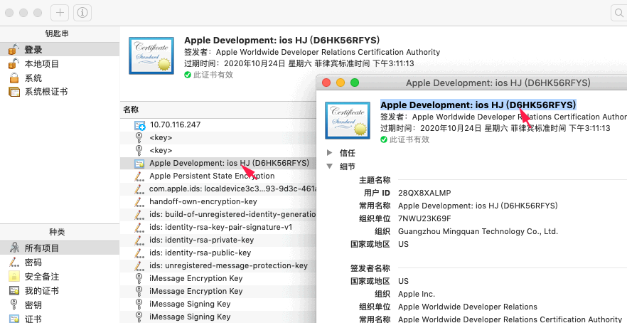


--

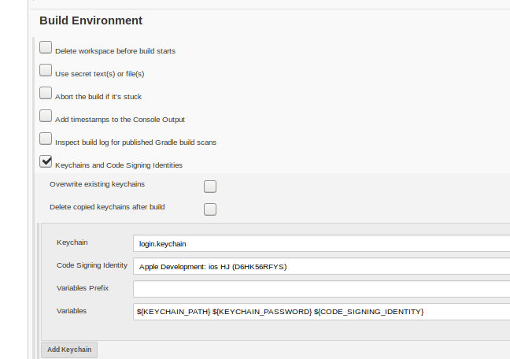

\--


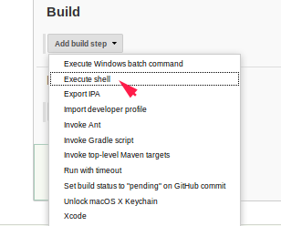

构建的脚本为

```shell
#!/bin/sh

work_all='/data/jenkins/worksqace/workspace'

cd ${work_all}/ios_app_conf
git pull

x='uat'
thejob='viba_ios_uat'
cd -

# 第一次创建job的工程目录时要pod安装依赖库和第三方库
pod install

# 让ssh执行有用户身份可以访问ios开发者证书
security unlock-keychain -p "mini@build" ~/Library/Keychains/login.keychain


source ${work_all}/ios_app_conf/${x}/config.plist begin
rm -rf lottery-ticket/Assets/AssetsBUILD.xcassets
cp -r ${work_all}/ios_app_conf/${x}/AssetsBUILD.xcassets lottery-ticket/Assets/AssetsBUILD.xcassets


cat ${work_all}/ios_app_conf/Template/LT-BUILD.plist > lottery-ticket/infoPlist/LT-BUILD.plist
cat ${work_all}/ios_app_conf/Template/DOMAIN.plist > lottery-ticket/LTResourceFiles/plistfiles/DOMAIN.plist

sed -i "" 's#<string>$(PRODUCT_NAME)</string>#<string>'${CFBundleDisplayName}'</string>#g' lottery-ticket/infoPlist/LT-BUILD.plist
sed -i "" 's#<string>$(PRODUCT_BUNDLE_IDENTIFIER)</string>#<string>'${CFBundleIdentifier}'</string>#g' lottery-ticket/infoPlist/LT-BUILD.plist
sed -i "" 's#<string>$(MARKETING_VERSION)</string>#<string>'${CFBundleShortVersionString}'</string>#g' lottery-ticket/infoPlist/LT-BUILD.plist
sed -i "" 's#<string>https://api.viba.work</string>#<string>'${domain[0]}'</string>#g' lottery-ticket/LTResourceFiles/plistfiles/DOMAIN.plist

#设置路径
kWorkSpacePath=${work_all}'/'${thejob}'/lottery-ticket.xcworkspace'
kArchivePath='/Users/opser/Documents/AutoBuild/Archive/dev.xcarchive'
mkdir /data/jenkins/worksqace/ios/${x}
kIpaPath='/data/jenkins/worksqace/ios/'${x}
kOptionPath=${work_all}'/ios_app_conf/'${x}'/ExportOptions.plist'
#设置schmem
kSchmemName='LT-BUILD'
echo $kOptionPath


#这个命令主要是用来clean，clean的是Release的路径，clean的是/Users/app***eCloud.xcworkspace路径的eCloud
xcodebuild -workspace $kWorkSpacePath -scheme $kSchmemName -configuration 'Release' clean

#这个是生成xcarchive，Release的
xcodebuild -workspace $kWorkSpacePath -scheme $kSchmemName -archivePath $kArchivePath -configuration "Release" archive

#这个是将xcarchive文件打包成ipa
xcodebuild -exportArchive -archivePath $kArchivePath -exportPath $kIpaPath -exportOptionsPlist $kOptionPath -allowProvisioningUpdates

rm -f /data/jenkins/worksqace/ios/ipa/${x}.ipa
mv /data/jenkins/worksqace/ios/${x}/*.ipa /data/jenkins/worksqace/ios/ipa/${x}.ipa
cp ${work_all}/ios_app_conf/Template/download.plist /data/jenkins/worksqace/ios/plist/${x}.plist
sed -i "" 's#https://ios.viba.work/t08.ipa#https://ios.viba.work/ipa/'${x}'.ipa#g' /data/jenkins/worksqace/ios/plist/${x}.plist
sed -i "" 's#com.zoozv.uat#'${CFBundleIdentifier}'#g' /data/jenkins/worksqace/ios/plist/${x}.plist
sed -i "" 's#手淘网-uat#'${CFBundleDisplayName}'#g' /data/jenkins/worksqace/ios/plist/${x}.plist

# 生成下载页面
curl https://ipa.viba.work/ > index.html
sed -i "" "s#href=\"#href=\"itms-services://?action=download-manifest\&url=https://ios.viba.work/plist/#g" index.html
sed -i "" "s#.ipa\"#.plist\"#g" index.html
mv index.html /data/jenkins/worksqace/ios/.
ls -l /data/jenkins/worksqace/ios/ipa/*.ipa
```

