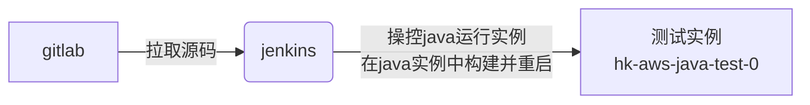

参考:

https://blog.csdn.net/sinat_34344123/article/details/80310603

## 架构及部署流程图

**测试环境

```mermaid
graph LR
A[gitlab] --> |拉取源码| B(jenkins)
B --> |操控java运行实例<br/>在java实例中构建并重启| C[测试实例<br/>hk-aws-java-test-0]
```

目录

- [1.jenkins实例环境配置.md](jenkins实例环境配置.md)
- [2.配置测试环境实例为jenkins的slave节点](配置测试环境实例为jenkins的slave节点.md)

