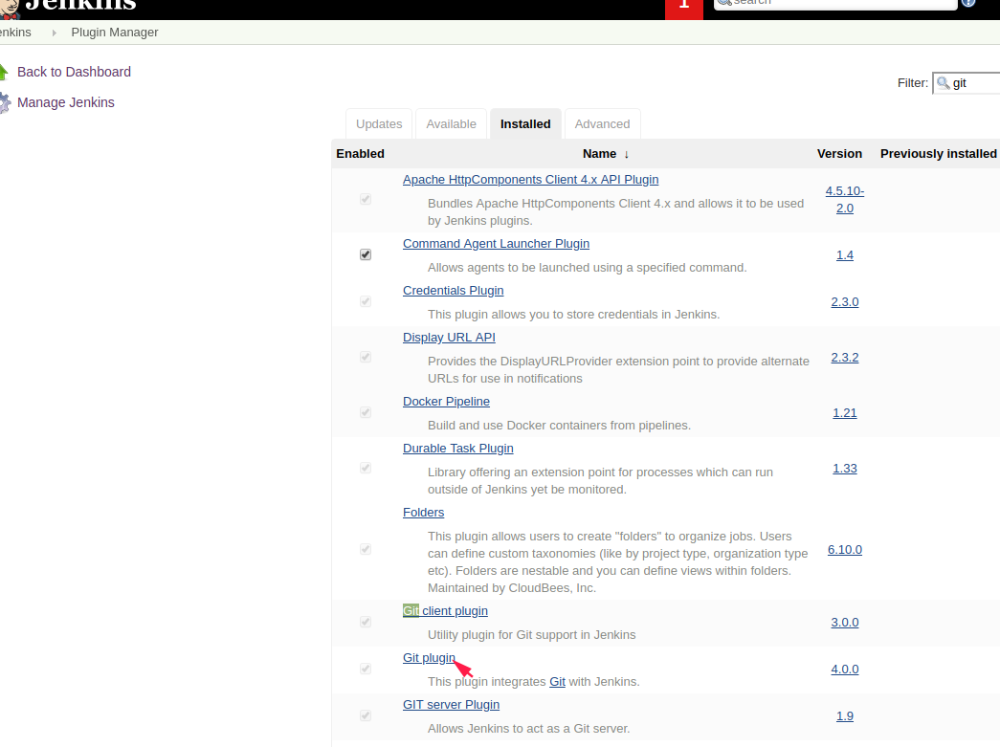

## 配置jenkins所需插件


执行这一步之前，我们在第一次启动jenkins的时候，已经安装过大部分插件，所以我们只需要检查是否安装了以下插件即可

1.Maven Integration 使我们可以开始一个maven项目作为任务

2.Git plugin 使我们可以读取存放在git仓库的项目


\--

一般git 插件是有部署好时推荐安装的



\---


## 配置jenkins全局工具


配置jenkins的全局工具主要是我们所使用到的 jdk、git、maven等


\--


/usr/local/jdk/bin/java


yum install -y git 


/bin/git


maven 


/usr/local/maven/bin/mvn


\---

## 安装插件


由于我们用maven来构建,所以要有 [Maven Integration](https://plugins.jenkins.io/maven-plugin)


## 新建任务并配置任务相关设置


我让jenkins用户来拉取git仓库代码


编辑 /etc/passwd

```
jenkins:x:997:994:Jenkins Automation Server:/var/lib/jenkins:/bin/false
```


修改为 


```
jenkins:x:997:994:Jenkins Automation Server:/var/lib/jenkins:/bin/bash
```


cd /var/lib/jenkins


mkdir .ssh


