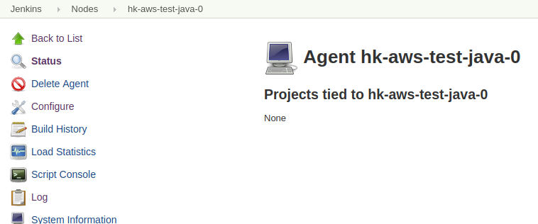

[TOC]


## 1.在java测试环境的实例中创建jenkins用户,并设置密码


```
[root@hk-aws-java-test-0 ~]# useradd jenkins
[root@hk-aws-java-test-0 ~]# passwd jenkins
..
...
[root@hk-aws-java-test-0 ~]# mkdir /data/jenkins
[root@hk-aws-java-test-0 ~]# chown -R jenkins:jenkins /data/jenkins/
```


## 2.登录jenkins master端

进入 "Manage Jenkins" -> "Manage Nodes"


进入"new Node"


填写节点信息


添加这个节点主机的用户访问凭证


填写个在slave实例上的系统用户和密码


回来选择上我们刚才添加的这个用户凭证


先要把 Host Key Verification Strategy 设置为 : Non verifying Verification Strategy


然后Host Key Verification Strategy 再换为 Known hosts file Verification Strategy

这样才能连接上,因为第一次登录主机known 文件里没有连接记录


\--


配置成功后就是这样




