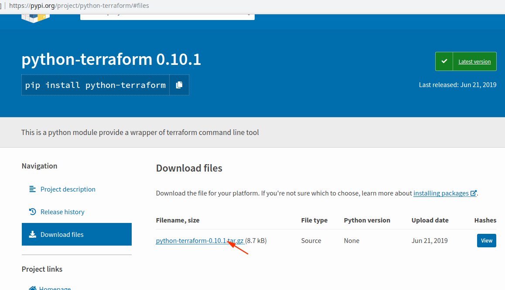

## 安装包

你的系统中一样要先安装 terraform,这个不在这里介绍了


下载模块包




```
wget https://files.pythonhosted.org/packages/60/a2/10fa8a5d79096f96f0a1b9917fe3038b453e40b39cc22e07410a365f2dc3/python-terraform-0.10.1.tar.gz
tar -xf python-terraform-0.10.1.tar.gz
cd python-terraform-0.10.1/
sudo python3 setup.py install
```


安装好后来看一下有那些方法

```
$ python3
Python 3.6.7 (default, Oct 22 2018, 11:32:17) 
[GCC 8.2.0] on linux
Type "help", "copyright", "credits" or "license" for more information.
>>> from python_terraform import *
>>> dir(Terraform())
['__class__', '__delattr__', '__dict__', '__dir__', '__doc__', '__eq__', '__exit__', '__format__', '__ge__', '__getattr__', '__getattribute__', '__gt__', '__hash__', '__init__', '__init_subclass__', '__le__', '__lt__', '__module__', '__ne__', '__new__', '__reduce__', '__reduce_ex__', '__repr__', '__setattr__', '__sizeof__', '__str__', '__subclasshook__', '__weakref__', '_generate_default_args', '_generate_default_options', 'apply', 'cmd', 'create_workspace', 'delete_workspace', 'destroy', 'generate_cmd_string', 'init', 'is_env_vars_included', 'output', 'parallelism', 'plan', 'read_state_file', 'set_workspace', 'show_workspace', 'state', 'targets', 'temp_var_files', 'terraform_bin_path', 'tfstate', 'var_file', 'variables', 'working_dir']
>>> 
```


## 来一个例子


```

$ cat main.tf
provider "aws" {
  access_key = "wfwfwo****"
  secret_key = "Bk0UBK1***********f"
  region = "eu-north-1"
}

resource "aws_instance" "example" {
 ami = "ami-2757f631"   # 这要换上你有的镜像
 instance_type = "t3.micro"
}

$ python3
Python 3.6.7 (default, Oct 22 2018, 11:32:17) 
[GCC 8.2.0] on linux
Type "help", "copyright", "credits" or "license" for more information.
>>> from python_terraform import *
>>> t = Terraform()
>>> t.init()
(0, '\nInitializing the backend...\n\nInitializing provider plugins...\n- Checking for available provider plugins...\n- Downloading plugin for provider "aws" (hashicorp/aws) 2.43.0...\n\nThe following providers do not have any version constraints in configuration,\nso the latest version was installed.\n\nTo prevent automatic upgrades to new major versions that may contain breaking\nchanges, it is recommended to add version = "..." constraints to the\ncorresponding provider blocks in configuration, with the constraint strings\nsuggested below.\n\n* provider.aws: version = "~> 2.43"\n\nTerraform has been successfully initialized!\n\nYou may now begin working with Terraform. Try running "terraform plan" to see\nany changes that are required for your infrastructure. All Terraform commands\nshould now work.\n\nIf you ever set or change modules or backend configuration for Terraform,\nrerun this command to reinitialize your working directory. If you forget, other\ncommands will detect it and remind you to do so if necessary.\n', '')

# 由于它是返回一个元组,第2个元素是回执信息,全部在一起并不方便阅读,所以我们接下来要处理成一行一行看

>>> for pstr in t.plan()[1].split('\n'):
...     print(pstr)
... 
Refreshing Terraform state in-memory prior to plan...
The refreshed state will be used to calculate this plan, but will not be
persisted to local or remote state storage.


------------------------------------------------------------------------

An execution plan has been generated and is shown below.
Resource actions are indicated with the following symbols:
  + create

Terraform will perform the following actions:

  # aws_instance.example will be created
  + resource "aws_instance" "example" {
      + ami                          = "ami-2757f631"
      + arn                          = (known after apply)
      + associate_public_ip_address  = (known after apply)
      + availability_zone            = (known after apply)
      + cpu_core_count               = (known after apply)
      + cpu_threads_per_core         = (known after apply)
      + get_password_data            = false
      + host_id                      = (known after apply)
      + id                           = (known after apply)
      + instance_state               = (known after apply)
      + instance_type                = "t2.micro"
      + ipv6_address_count           = (known after apply)
      + ipv6_addresses               = (known after apply)
      + key_name                     = (known after apply)
      + network_interface_id         = (known after apply)
      + password_data                = (known after apply)
      + placement_group              = (known after apply)
      + primary_network_interface_id = (known after apply)
      + private_dns                  = (known after apply)
      + private_ip                   = (known after apply)
      + public_dns                   = (known after apply)
      + public_ip                    = (known after apply)
      + security_groups              = (known after apply)
      + source_dest_check            = true
      + subnet_id                    = (known after apply)
      + tenancy                      = (known after apply)
      + volume_tags                  = (known after apply)
      + vpc_security_group_ids       = (known after apply)

      + ebs_block_device {
          + delete_on_termination = (known after apply)
          + device_name           = (known after apply)
          + encrypted             = (known after apply)
          + iops                  = (known after apply)
          + kms_key_id            = (known after apply)
          + snapshot_id           = (known after apply)
          + volume_id             = (known after apply)
          + volume_size           = (known after apply)
          + volume_type           = (known after apply)
        }

      + ephemeral_block_device {
          + device_name  = (known after apply)
          + no_device    = (known after apply)
          + virtual_name = (known after apply)
        }

      + network_interface {
          + delete_on_termination = (known after apply)
          + device_index          = (known after apply)
          + network_interface_id  = (known after apply)
        }

      + root_block_device {
          + delete_on_termination = (known after apply)
          + encrypted             = (known after apply)
          + iops                  = (known after apply)
          + kms_key_id            = (known after apply)
          + volume_id             = (known after apply)
          + volume_size           = (known after apply)
          + volume_type           = (known after apply)
        }
    }

Plan: 1 to add, 0 to change, 0 to destroy.

------------------------------------------------------------------------

Note: You didn't specify an "-out" parameter to save this plan, so Terraform
can't guarantee that exactly these actions will be performed if
"terraform apply" is subsequently run.

>>> for pstr in t.apply(skip_plan = True)[1].split('\n'):
...     print(pstr)
... 

aws_instance.example: Creating...
aws_instance.example: Still creating... [10s elapsed]
aws_instance.example: Still creating... [20s elapsed]
aws_instance.example: Creation complete after 21s [id=i-0bd5f32536ff1e984]

Apply complete! Resources: 1 added, 0 changed, 0 destroyed.

>>> 
>>> for pstr in t.show()[1].split('\n'):
...     print(pstr)
... 
# aws_instance.example:
resource "aws_instance" "example" {
    ami                          = "ami-018d40a5c78935fd0"
    arn                          = "arn:aws:ec2:eu-north-1:698981732051:instance/i-0bd5f32536ff1e984"
    associate_public_ip_address  = true
    availability_zone            = "eu-north-1b"
    disable_api_termination      = false
    ebs_optimized                = false
    get_password_data            = false
    id                           = "i-0bd5f32536ff1e984"
    instance_state               = "running"
    instance_type                = "t3.micro"
    ipv6_address_count           = 0
    ipv6_addresses               = []
    monitoring                   = false
    primary_network_interface_id = "eni-092873ed7860a734e"
    private_dns                  = "ip-172-31-39-105.eu-north-1.compute.internal"
    private_ip                   = "172.31.39.105"
    public_dns                   = "ec2-13-53-42-91.eu-north-1.compute.amazonaws.com"
    public_ip                    = "13.53.42.91"
    security_groups              = [
        "default",
    ]
    source_dest_check            = true
    subnet_id                    = "subnet-1491606f"
    tenancy                      = "default"
    volume_tags                  = {}
    vpc_security_group_ids       = [
        "sg-b3a102d9",
    ]

    credit_specification {
        cpu_credits = "unlimited"
    }

    root_block_device {
        delete_on_termination = false
        encrypted             = false
        iops                  = 100
        volume_id             = "vol-09fcb3eeb51ed086f"
        volume_size           = 8
        volume_type           = "gp2"
    }
}


```


我列出一下terraform命令对应的这python语句

```

terraform init
>>> t.init()    

terraform plan
>>> t.plan()

terraform apply --auto-approve
>>> t.apply(skip_plan = True) 

terraform show
>>> t.show()
```


